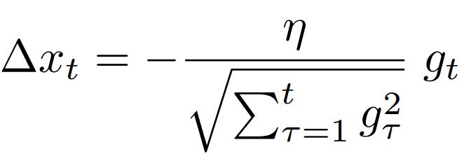

# AdaDelta Algorithm

## Introduction
AdaDelta is an optimization algorithm developed to improve upon the Adagrad method. It addresses the diminishing learning rates problem of Adagrad by accumulating a window of past squared gradients and then using this accumulation to scale the learning rate. This approach allows AdaDelta to continue learning even when many updates have been done.

## Algorithm Overview
The key idea behind AdaDelta is to use a running average of the squared gradients to scale updates, which helps in mitigating the aggressive, monotonically decreasing learning rate of Adagrad. Unlike Adagrad, AdaDelta does not require an initial learning rate setting, making it easier to configure.

### Key Features:
- Robust to large gradients
- Self-adjusting learning rate
- Does not require a manually set learning rate

## Mathematical Representation

## Implementation
You can find the Python implementation of the AdaDelta algorithm in our repository. This implementation demonstrates the core principles of AdaDelta in a clear and concise manner.

[View AdaDelta Implementation](link-to-python-file/Adadelta.py)

*Note: Replace `link-to-python-file/Adadelta.py` with the actual link to your Python file.*

## References
- Original Paper: [ADADELTA: An Adaptive Learning Rate Method](https://arxiv.org/abs/1212.5701) by Matthew D. Zeiler

---

For more information on other optimization algorithms and their implementations, visit our [main documentation page](../papers).

