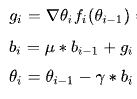

# Momentum Optimization Algorithm

## Introduction
The Momentum algorithm is a popular optimization technique in the field of machine learning and deep learning. It is designed to accelerate gradients vectors in the right directions, thus leading to faster converging. It is one of the enhancements to the standard gradient descent optimization method.

## Algorithm Overview
Momentum optimization is inspired by the physical concept of momentum in which an object in motion tends to stay in motion. In the context of optimization, it helps to push the algorithm across valleys and over smaller hills, potentially leading to faster convergence compared to standard gradient descent.

### Key Features:
- Accelerates convergence in relevant directions
- Helps to overcome local minima problems
- Often leads to faster training than standard gradient descent

## Mathematical Representation

## Implementation
The Python implementation of the Momentum algorithm can be found in our repository. This code provides a practical example of how Momentum can be applied in optimization tasks.

[View Momentum Implementation](link-to-python-file/Momentum.py)

## References
- For a deeper understanding of the Momentum algorithm, you can refer to relevant literature in optimization techniques for neural networks and [SGD momentum optimizer paper](https://optimization.cbe.cornell.edu/index.php?title=Momentum).

---

Explore more about different optimization algorithms and their applications in our [main documentation page](link-to-main-documentation).
